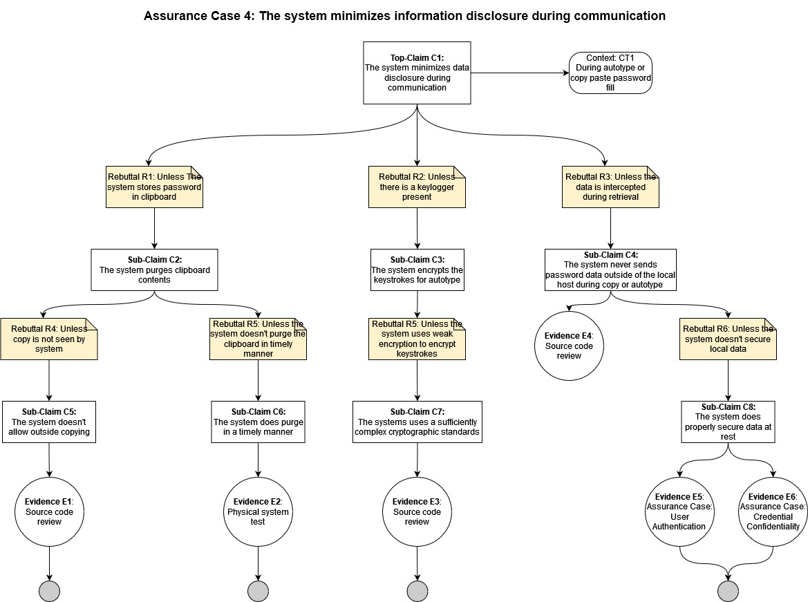

## Assurance Claim 4: The system minimizes information disclosure during communication
[Back to Assurance Cases](https://github.com/JCKelley-CYBR/CYBR-8420-SoftwareAssurance/blob/main/AssuranceCases/README.md)

### Description:
As a password manager, KeePassXC creates and stores passwords. Additionally, KeePassXC must have a way to retrieve those passwords. Retrieval and communication of these passwords must be done securely and in a manner that is convenient to the user. For this, KeePassXC uses copying to a clipboard or autotype.

During the use of passwords, there must be a concern about how it is done securely. Therefore, when passwords are communicated, copied, or autotype, KeePassXC will minimize the disclosure of data. 

### Alignment Assessment

- **E1**: Currently not implemented, but the system could prevent any copy function outside of its own from working so that the system can purge password data from the clipboard and is never out of view of the system.

- **E2**: KeePassXC does store the contents of the password to the clipboard if copied, which can be insecure if someone gains access to the machine and the password is still remembered. However, the system does clear the clipboard after 10 seconds so that the user gets enough time to paste the password, but it does not continue to exist afterward. This protection helps minimize disclosure by preventing someone with physical access from seeing credentials stored in the clipboard.

- **E3**: Not currently implemented. The system could encrypt the keystrokes for autotype with a cryptographically secure standard such as AES 256. This addition would avoid accidental disclosure of information during autotype.

- **E4**: A source review shows that no connections are made when copying a password or using an autotype to fill in the password. This functionality helps minimize the disclosure of data by keeping it local throughout usage.

- **E5**: See Assurance Case: [User Authentication](link) 

- **E6**: See Assurance Case: [Credential Confidentiality](link)

### Diagram

