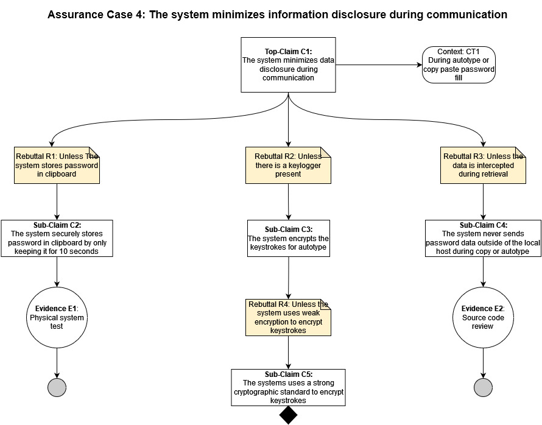

## Assurance Claim 3: The system minimizes information disclosure during communication
[Back to Assurance Cases](https://github.com/JCKelley-CYBR/CYBR-8420-SoftwareAssurance/blob/main/AssuranceCases/README.md)

### Description:
As a password manager, KeePassXC creates and stores passwords. Additionally, KeePassXC must have a way to retrieve those passwords. Retrieval and communication of these passwords must be done securely and in a manner that is convenient to the user. For this KeePassXC uses copying or autotype.

During use of passwords, there must be the concern of how it is done securely. Therefore, when passwords are communicated, being copying or autotype, KeePassXC will minimize disclosure of data. 

### Alignment Assessment

- **E1**: KeePassXC does store the contents of the password to the clipboard if copied which can be insecure if someone gains access to the machine and the password is still remembered. However, the system does clear the clipboard after 10 seconds so that the user gets enough time to paste the password but it does not continue to exist afterwards.

- **E2**: A review of the source shows that no connections are made when copying a password or when using autotype to fill the password. 

### Diagram

