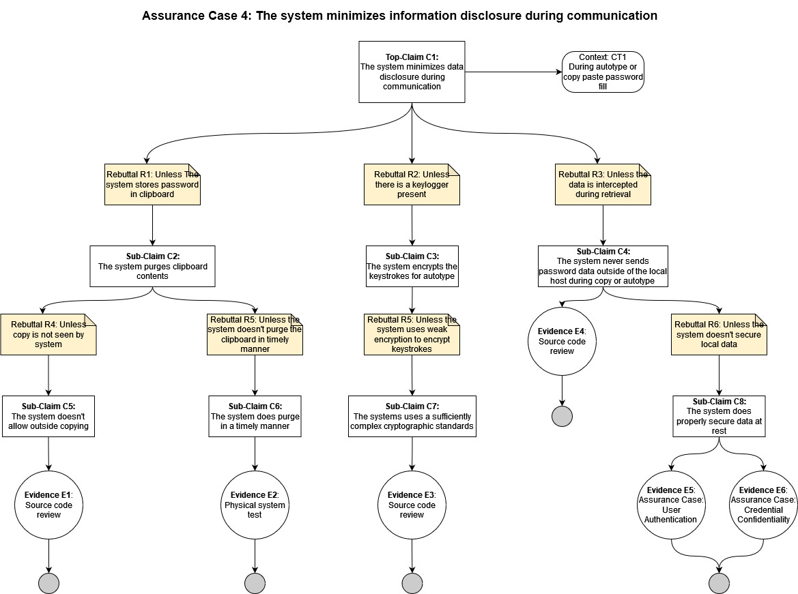

## Assurance Claim 4: The system minimizes information disclosure during communication
[Back to Assurance Cases](https://github.com/JCKelley-CYBR/CYBR-8420-SoftwareAssurance/blob/main/AssuranceCases/README.md)

### Description:
As a password manager, KeePassXC creates and stores passwords. Additionally, KeePassXC must have a way to retrieve those passwords. Retrieval and communication of these passwords must be done securely and in a manner that is convenient to the user. For this KeePassXC uses copying to clipboard or autotype.

During use of passwords, there must be the concern of how it is done securely. Therefore, when passwords are communicated, being copying or autotype, KeePassXC will minimize disclosure of data. 

### Alignment Assessment

- **E1: Outside copy function prevention**: Currently not implemented, but the system could prevent any copy function outside of it's own from working so that the system can purge password data from the clipboard and it is never out of view of the system.

- **E2: Purge clipboard**: KeePassXC does store the contents of the password to the clipboard if copied which can be insecure if someone gains access to the machine and the password is still remembered. However, the system does clear the clipboard after 10 seconds so that the user gets enough time to paste the password but it does not continue to exist afterwards. This helps minimize disclosure by preventing someone with physical access the ability to see credentials stored in the clipboard.

- **E3: Keystroke encryption**: Not currently implemented, the system could encrypt the keystrokes for autotype and do so with a cryptographically secure standard such as AES 256 to avoid accidental disclosure of information during autotype.

- **E4: Offline communications**: A review of the source shows that no connections are made when copying a password or when using autotype to fill the password. This helps minimize the disclosure of data by keeping it local through out usage.

- **E5: Securing data at rest**: See Assurance Case: [User Authentication](https://github.com/JCKelley-CYBR/CYBR-8420-SoftwareAssurance/tree/main/AssuranceCases/User_Auth) 

- **E6: Securing data at rest**: See Assurance Case: [Credential Confidentiality](https://github.com/JCKelley-CYBR/CYBR-8420-SoftwareAssurance/tree/main/AssuranceCases/Credential_Confidentiality)

### Diagram

