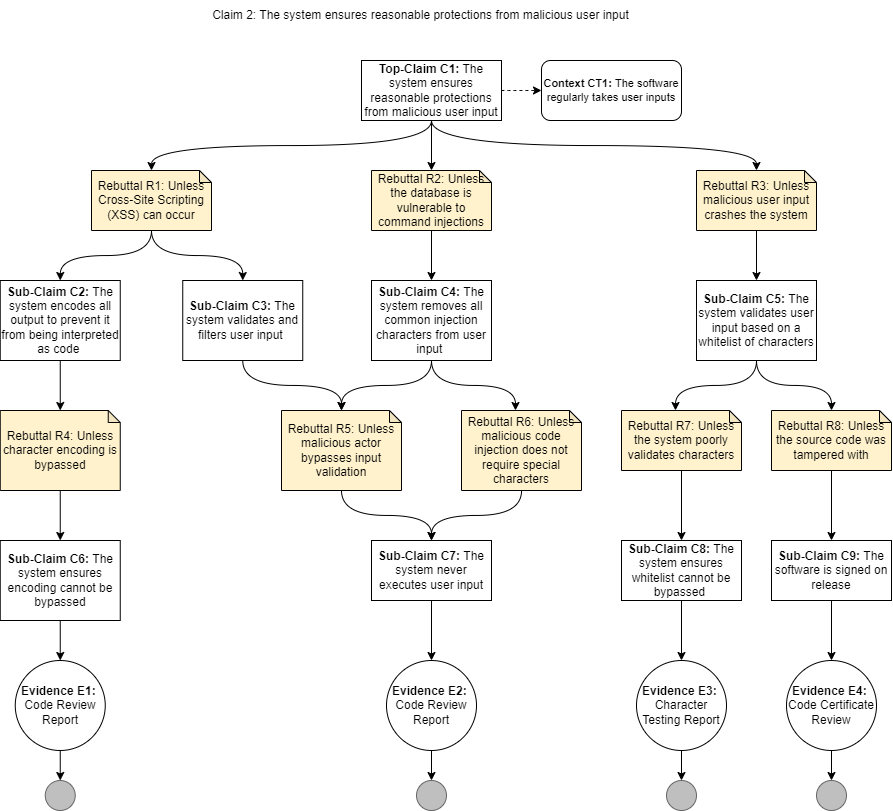

# Claim 2 - The system ensures reasonable protections from malicious user input

[Back to Assurance Cases](https://github.com/JCKelley-CYBR/CYBR-8420-SoftwareAssurance/blob/main/AssuranceCases.md)

### Description
KeePassXC takes user input in multiple places. If this input is not handled correctly, it could lead to command injection, leakage of the database, or more. Due to the critical nature of this security requirement, we need assurance that malicious input has been mitigated.

## Alignment Analysis
KeePassXC provides the following evidence per the Assurance Cases identified (E1-E4) in the diagram below:
* **E1: *Source Code Review: XSS Prevention*** - KeePassXC does not have a web interface so no source code would reveal the possibility of an XSS attack. Therefore, this adheres to our Assurance Case.

* **E2: *Source Code Review: User Input Execution Prevention*** - KeePassXC does not execute any commands based on user input. The KDBX database is accessed like an array and only uses indexes to gather and store information, not inputted user strings. 

* **E3: *Character Testing Report*** - KeePassXC does not prohibit any characters in logins or stored credentials. Instead, KeePassXC interprets all inputted characters as a safe representation of that character and relies on the non-execution of the code to prevent execution. 

* **E4: *Code Certificate Review: Executable Signing*** - KeePassXC does not sign the executable published on their GitHub [releases](https://github.com/keepassxreboot/keepassxc/releases/tag/2.7.1). However, they release a signature file that can be installed and an SHA digest of the application. Since the signature must be installed separately, this is misaligned with our Assurance Case. 

## Diagram
 
