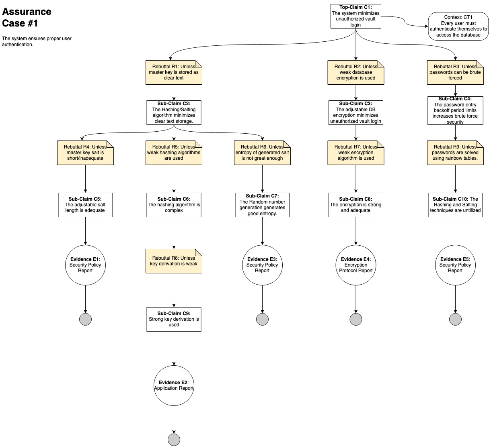

## Assurance Case #1
---
[Back to Assurance Cases](https://github.com/JCKelley-CYBR/CYBR-8420-SoftwareAssurance/blob/main/AssuranceCases.md)

### Description
Before any of the features of the password manager can be used, a user must authenticate themselves to unlock the database and access their data. Since this is a critical security requirement of operation, assurance is needed to minimize any worries related to the authenticaiton functionality in the application. 

### Alignment Analysis
The evidence listed in the assurance case diagram can be seen elaborated below E1-E5.
* E1: __Security Policy Report__- the system's master key is created at database generation. The security of the salt is actually set by the user and can be of any length, acheiving any needed adeuqate master key salt length.
* E2: __Application Review Report__- The application's key derivation is carried out via [Argon2](https://www.argon2.com/) and AES-KDF.
* E3: __Security Policy Report__- Salt generation is completed via a pool of random number generation. Although a length of salt can be selected, this has no bearing on the random number generation. The entropy pool is generated via the system cryptopgraphic provider, the current date/time, update, cursor position, OS version, processor count, environment variables, process and memory statistics, current culture, a new random GUID, etc. Higher level generation methods are generated by a random number generator based off of SHA-256/SHA-512.
* E4: __Encryption Protocol Report__- The master key is encrypted in a SHA-256 algorithm and is considered to be strong.
* E5: __Security Policy Report__- The user can select a backoff period or a time to attempt decryption during database creation. This backoff period inherently increases the time it would take for a brute-force attack to be sucessful, discouraging this attack vector.
### Diagram

