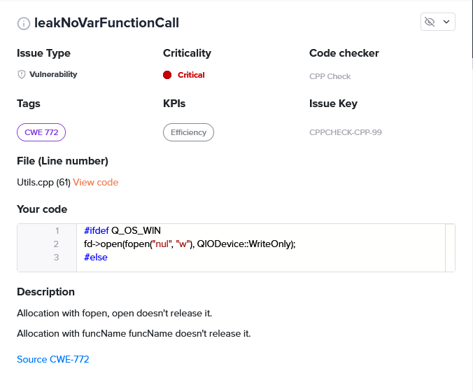
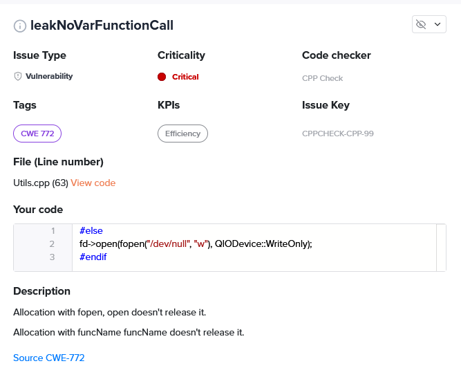
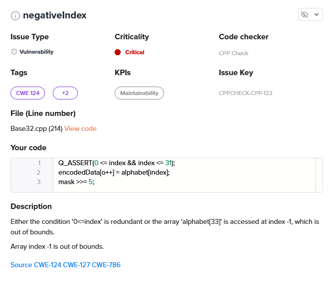

# Embold Analysis
[Back to CodeReview.md](https://github.com/JCKelley-CYBR/CYBR-8420-SoftwareAssurance/blob/main/CodeReview.md)
## Embold Analysis - Statics
* Overall Rating: 1.7 - *Acceptable*
* Executable Lines of Code: 387K
* Vulnerabilities: 49
    * Critical: 3
    * High: 8
    * Medium: 27
    * Low: 11
    * Security Related: 41
* Code Issues: 1.3k
    * High: 8
        * These are mostly related to the unconditional pointer return in src/zxcvbn/zxcvbn.c
* Anti-Patterns: 41
    * High: 24
        * These are all related to a Variable in KeePass2.h exposing the declared extern in the header file as non-private.

## Embold Useful Findings:
* CWE-772: Missing Release of Resource after Effective Lifetime is a weakness that occurs when a password manager fails to properly release a resource, such as a memory buffer or file handle, after it is no longer needed
    * leakNoVarFunctionCall: src/cli/Utils.cpp
        * Line 61
        ```C++
        fd->open(fopen("nul", "w"), QIODevice::WriteOnly);
        ```
        * Line 63
        ```C++
        fd->open(fopen("/dev/null", "w"), QIODevice::WriteOnly);
        ```
    * Embold reported this finding due to these files being opened but never closed. This is a false positive as the files are opened in write-only mode and are closed when the program exits.
    
    
* CWEs:
    * CWE-124: Buffer Over-write is a weakness that occurs when a password manager attempts to write data to a buffer that has been over-allocated, meaning that there is not enough space in the buffer to store the data that is being written.
    * CWE-127: Buffer Under-Read is a weakness that occurs when a password manager attempts to read data from a buffer that has been under-allocated, meaning that there is not enough memory allocated to the buffer to store the data that is being read.
    * CWE-786: Access of Memory Location Before Start of Buffer is a weakness that occurs when a password manager attempts to access a memory location before the start of a buffer. This can happen when the password manager attempts to read or write data to a memory location that is outside the bounds of the allocated memory buffer.
    * negativeIndex: src/core/Base32.cpp
        * Line 211-217
        ```C++
        while (n >= 0) {
            int index = (quantum & mask) >> n;
            Q_ASSERT(0 <= index && index <= 31);
            encodedData[o++] = alphabet[index];
            mask >>= 5;
            n -= 5;
        }
        ```
    * Embold reported this finding due to the index variable being used in an array access. This is a false positive function is not used in the program, and it is our recommendation this function be removed as it serves no purpose.
    

