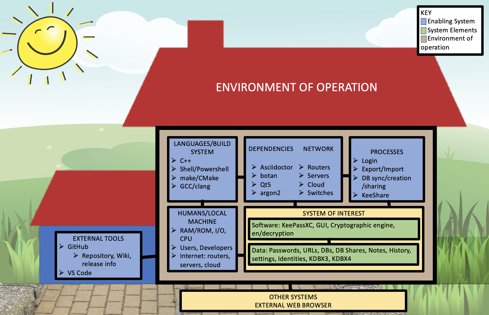

# CYBR 8420 - Project Proposal

# Team Let Me Make Sure Nobody is Breaking into My House Real Fast, One Sec

## Open-Source Project: KeyPass 

## Hypothetical Operation Environment

## System Engineering Diagram

## Perceived Threats

## Security Features

## Team Motivation
The interconnectivity of the mobile device provided fertile grounds for the Service-as-a-Product business model to grow unchecked, and in the last five years, Software-as-a-Service, eg. Adobe Cloud, Office 365, etc. has also seen an increase in popularity. For the individual, we now have more accounts over a larger variety of applications and services than ever before, a trend that is unlikely to slow down. Consequentially, password managers have seen a similar growth in popularity, not only in the enterprise environment, but also for the individual. These password managers provide convenience in exchange for a single potential point of failure. 

We identified the importance of security within password management software during our initial perusal of open source software, and shortlisted a number of open source projects that intersected with various proprietary password managers. After our initial discussion with Dr.Gandhi we settled on KeePassXC, a fairly popular and well maintained open source password manager with a health community of contributors.
## Open-Source Project Description

## Licensing Information

## Contributing
The KeePassXC team maintains a friendly community for project discussions on both [matrix](https://matrix.to/#/!zUxwGnFkUyycpxeHeM:matrix.org?via=matrix.org) and [Libera chat](https://web.libera.chat/), but they ask that new feature requests and bug reports be filed through the issue tracker on their Github repository. KeePassXC also welcomes direct contributions, be it code, documentation or artistic work. KeePassXC's [Open Source Contribution Policy](https://github.com/keepassxreboot/keepassxc/blob/develop/.github/CONTRIBUTING.md) provides a guideline for content and a [styleguide](https://github.com/keepassxreboot/keepassxc/blob/develop/.github/CONTRIBUTING.md#styleguides) that they ask all pull requests to comply with. There is no official Contribution Agreement, and their Contribution Policy is to "accept good code that they can use from anyone", meaning as long as they judge the contribution as suitiable, functional, efficient and not restricted by licening issues, the team will accept it. Translations for KeepPassXC are managed via [Transifex](https://explore.transifex.com/keepassxc/keepassxc/), the KeePassXC team asks that contributors join an existing language team or request a new translation if there is not an existing one. 

## Security Related History

## Repo Link
https://github.com/JCKelley-CYBR/CYBR-8420-SoftwareAssurance

## Team Reflection
=======
# CYBR 8420 - Project Proposal

# Team Let Me Make Sure Nobody is Breaking into My House Real Fast, One Sec

## Open-Source Project: KeyPass 

## Hypothetical Operation Environment
KeepassXC provides a highly flexible password management solution for individuals and organizations. Allowing both local, network, and cloud storage of encrypted password databases and database shares. The software is expected in any environement to provide adequate encryption to maintain the confidentiality of the database contents, proper password maintanence ensuring password integrity, and ease of access for authorized individuals to ensure high availability.

Our hypothetical situation is based on a Regional Managed Service Provider (MSP) whose job is to routinely log in remotely to hundreds of different environments and servers to conduct normal IT operations for their clientele. Due to the number of different credentials shared between technicians, the department wants to implement a local, open-source password management solution called KeepassXC. This software will be critical to daily operations, allowing authorized technicians to access client systems' usernames, passwords, URLs, IP addresses, and Notes. KeepassXC enables the MSP to save these credentials into an encrypted, locally stored database to protect its contents and offer high availability to authorized technicians. Implementing KeepassXC into our corporate environment would increase the speed at which technicians can find proper credentials, use these credentials to carry out normal business operations on client systems, and improve our overall security posture by reducing the potential mishandling of client system credentials. The implementation would allow technicians to use a password, key file, or hardware key to unlock the database. The organization will create a root database and database shares only, including the necessary client credentials to complete their job responsibilities following the principle of least privilege.
## System Engineering Diagram

## Perceived Threats
In our selected environment of a Regional Managed Service Provider in which hundreds of environments' credentials are stored in a password manager such as KeyPass, there are many potential threats to the clientele's systems and their clients if the credentials are not properly stored. In order to properly perform our assessment of this software for the purposes of the hypothetical environment, these threats must be taken in to account and acknowledged. Below is a list of perceived threats to the environment all will be assumed with malicious intent or purpose:
* Hacker: A bad actor would try and gain access to the password database in order to obtain credentials to systems. Their motivation would be reputation or financial depending on their end goals and actions. Their targets would likely be easily accessible.
* Employee: A bad actor could try and exfiltrate passwords to sell to hackers or other interested parties. Their motivation would be financial or revenge. Their target would be their own employer.
* Contributor: A bad actor may make a contribution to the open source project that would allow them access to the database of our environment. Their motivation would be reputation or financial depending on their end goal. This could also leverage greater threats. This is a particularly emphasized problem due to there being no security policy on the github. Their target would be the source of the software.
## Security Features
* Separate storage for TOTP secrets as passwords
* Option to compile without networking
* Hundreds of contributors on an open source platform with thousands of contribution
* Yubikey integration for MFA
* AES 256 encryption standard with TwoFish and ChaCha20 as additional choices
* Database health reports (Password strength, Have I been Pwnd checks, statistics)
* Secure password generation
## Team Motivation

## Open-Source Project Description

## Licensing Information
KeepassXC is licensed under [GNU General Public License Version 2](https://github.com/keepassxreboot/keepassxc/blob/develop/LICENSE.GPL-2), [GNU General Public License Version 3](https://github.com/keepassxreboot/keepassxc/blob/develop/LICENSE.GPL-3), [GNU Lesser General Public License Version 2.1](https://github.com/keepassxreboot/keepassxc/blob/develop/LICENSE.LGPL-2.1), and [GNU Lesser General Public License Version 3](https://github.com/keepassxreboot/keepassxc/blob/develop/LICENSE.LGPL-3). KeepassXC's primary license is the GNU GLP v2. This license allows for copying, distributing, and/or modification of the software it is licensing. Under this license the authors do not offer any warranty. If someone wants to take this source code and offer it for free, or for charge, they must share the source code with the recipient and give the recipient all the rights they (the seller/distributer) have. The licensing of the third party file's used in the repository is detailed [here](https://github.com/keepassxreboot/keepassxc/blob/develop/COPYING).
## Contributing

## Security Related History

## Repo Link
https://github.com/JCKelley-CYBR/CYBR-8420-SoftwareAssurance

## Team Reflection
