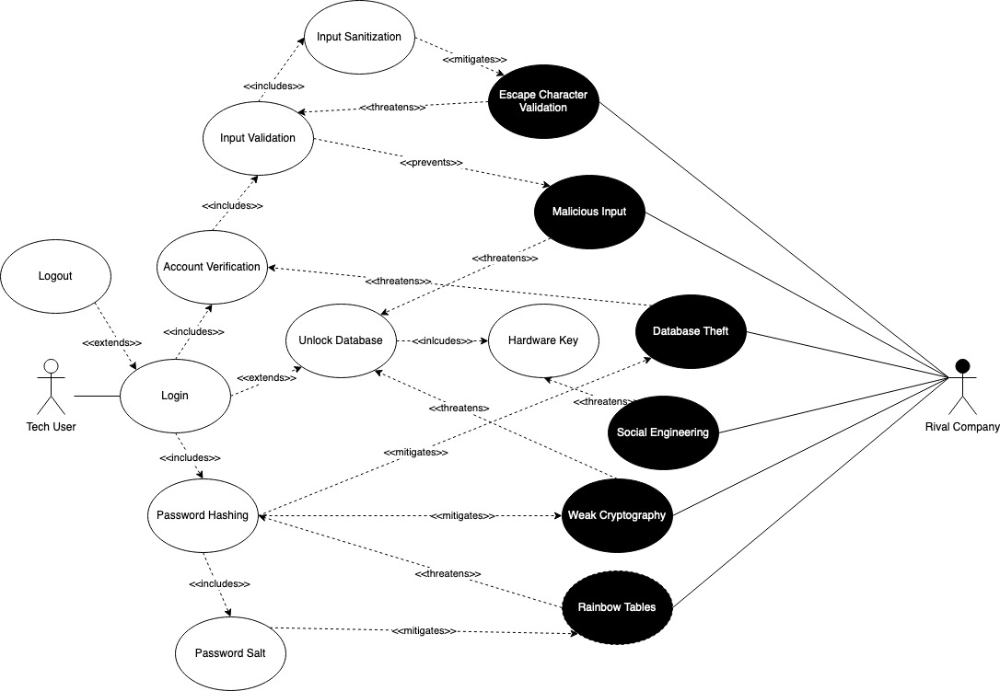

# Authenticate To Application
## Description
KeePassXC is based around an encrypte database file with a master password selected by the user. To access the database file, the user must login using KeePassXC. As such, the softwaremust ensure security is in enforced through use.

## Alignment Analysis
1. The below security requirements were determined by the use/misuse case diagram.
* Input Validation and Sanitation: Any input from users should be validated and sanitzed. Ensuring the login function can be exploited to skip authentication or execute malicious code.
* Encryption: Strong encryption is needed to ensure that the database cannot be exploited when locked/logging in or sessions cannot be hijacked while using the ssh agent.
* Password Hashing: Hashes of passwords must be computationally complex to ensure the password database is secure.
* Password Salting: Ensures the security of the database and mitigates threats from rainbow tables.
2. Below are the security features implement
* Argon2 Key derivation for password hashing
* HMAC-SHA-256 for header data authentication
* Hardware call-response challenge

