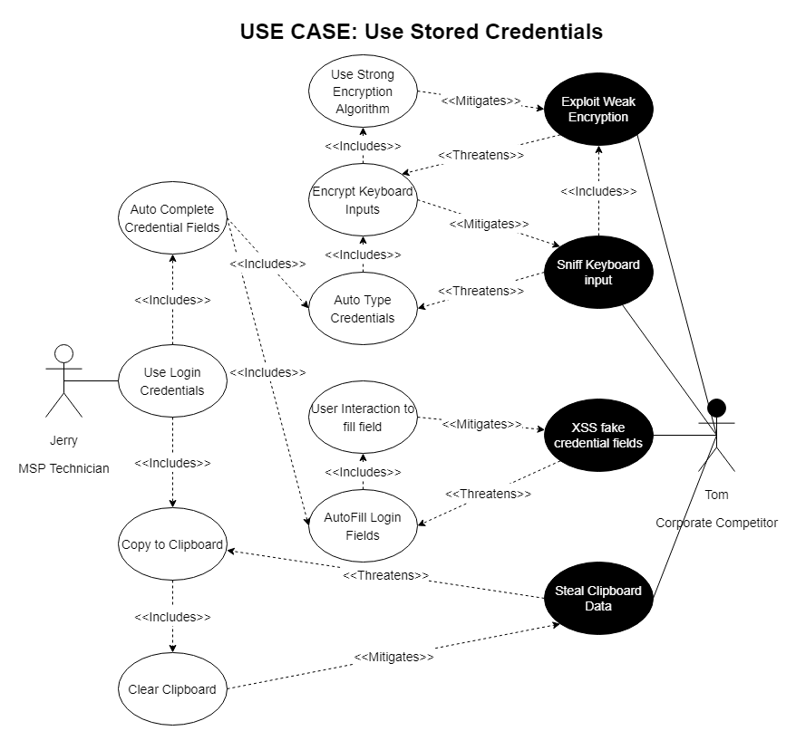

# Use Case: Using Stored Credentials

[Back to Security Requirements](https://github.com/JCKelley-CYBR/CYBR-8420-SoftwareAssurance/blob/main/SecurityRequirements.md)

## Description:
KeePassXC must provide each user with the ability to use credentials stored within its secure databases. While utilizing this functionality, KeePassXC must mitigate or prevent security threats on the credentials while in motion to ensure the software and accounts stored in the database remain secure.
## Alignment Analysis
1. The security requirements identified through the use/misuse analysis of using credentials created the following critical security-based components:
    * **Misuse**: Steal clipboard contents.
        * Mitigation: Clear clipboard contents after use. The risk of attacks targetting the clipboard contents and history can be mitigated by clearing the clipboard.
    * **Misuse**: Browser Cross-site Scripting (XSS) to steal auto-filled credentials.
        * Mitigation: Require User Interaction for Autofilling fields - By requiring user interaction to autofill fields on web applications, Cross-site scripting (XSS) attacks where attackers add a hidden credential field can be mitigated.
    * **Misuse**: Keylog credentials when utilizing auto-type functionality.
        * Prevention: Encrypt keyboard inputs of credentials. Encrypting keyboard inputs is critical to protect auto-typed passwords from being captured by a keylogger.
    * **Misuse**: Exploit weak encryption on keystroke encryption.
        * Prevention: Use strong encryption on keystroke encryption. Strong encryption is necessary to protect keyboard inputs from being decrypted/exploited when auto-typing credentials into fields.

2. Security features currently implemented in KeepassXC meet the above requirements:
    * AutoFill requires user interaction to autofill login fields on browsers as documented [here](https://keepassxc.org/docs/KeePassXC_GettingStarted.html#_using_the_browser_extension).
    * The application automatically clears the clipboard's contents 10 seconds after copying either the username, password, or a URL from KeePassXC as detailed [here]().
3. Security features *not* currently implemented in KeePassXC meeting the above requirements:
    * KeePassXC does not use encryption on its keyboard inputs (Keystroke Encryption) when utilizing AutoType. This lack of security functionality makes KeePassXC vulnerable to exposing cleartext passwords via a keylogger.
        * Due to the lack of encryption on the autotype feature, it also lacks strong encryption on this functionality, such as RSA 2048-bit.

## Diagram

