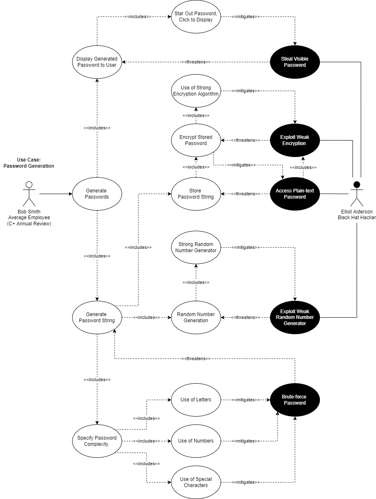

# Use Case: Password Generation

[Back to Security Requirements](https://github.com/JCKelley-CYBR/CYBR-8420-SoftwareAssurance/blob/main/SecurityRequirements.md)

## Description:
The application should generate strong, unpredictable, non-brute forceable passwords for usage across sites and applications. 

## Alignment Analysis:
I. Security requirements deemed necessary through the use/misuse case diagramming process are as follows:
* *Star Password* - Start or blank the password to prevent shoulder surfing.
* *Strong Encryption Algorithm* - Strong cryptographic standards should be used to prevent the encrypted credentials' from being cracked.
* *Strong Random Number Generation* - A robust random number generator prevents an attacker from predicting a generated password.
* *Generated Password Complexity* - The user should be able to generate passwords with letters, numbers, and special characters to mitigate the possibility of brute-forcing the password.

II. Security features included within KeePassXC in regards to prior requirements:
* *Blanks Password* - The application blanks out the password.
* *[Strong Cryptographic Standards](https://keepassxc.org/docs/KeePassXC_UserGuide.html#_database_settings)* - The application uses 256-bit AES encryption with the option of using ChaCha20 or Twofish.
* *Generated Password Complexity* - KeePassXC allows the user to specify the use of all three options when generating a password.

III. Observations:

Overall, KeePassXC meets the necessary security requirements through the use/misuse case diagramming process. However, the KeePassXC documentation does not specify the process of generating a random password. This will need further investigation through source code analysis to determine the alignment with the security requirements. 

## Diagram:

V4 of the Password Generation Diagram lacks a level of abstraction, which makes the diagram worse but correct. Please refer to V3 if a better viewing experience is preferred with a more sensical diagram.
