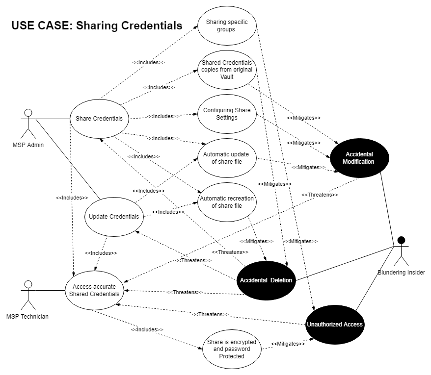

# Use Case: Sharing Credentials

[Back to Security Requirements](https://github.com/JCKelley-CYBR/CYBR-8420-SoftwareAssurance/blob/main/SecurityRequirements.md)

## Description:
KeePassXC must provide the organization with the ability to use a unified set of credentials across the organization. Approved users must be able to access these credentials when needed to perform their tasks and Administrators must be able to add, remove and modify these credentials as necessary. At no time should unapproved individuals inside or outside the organization be able to access or modify these credentials.

## Alignment Analysis
1. The security requirements identified through the use/misuse analysis of sharing credentials highlighted the following critical security components:
    * **Misuse**: Unauthorized access to the KeeShare or shared credentials by members of the organization.
        * Mitigation: When sharing credentials, the admin should be able to restrict specific shared credentials. Additionally, the share should be encrypted and password protected in the same manner as the original vault.
  
    * **Misuse**: Unauthorized, malicious or accidental modification to the shared credentials by members of the organization.
        * Mitigation: When sharing credentials within the organization, technicians should be given a copy of the credentials and should not be able to modify the original credentials. Additionally, everytime shared credentials are accessed, they should be freshly copied from the original credentials.
  
    * **Misuse**: Unauthorized, malicious or accidental relocation or deletion of the shared vault by members of the organization.
        * Mitigation: Similar to the mitigation for modifications, shared credentials should be copies of the original credentials, and new copies should be generated each time the share is updated or accesses.

2. Security features in KeepassXC that meet the above requirements:
    * When creating a KeeShare, admins are able to specify that only specific groups to be included in the share.
    * When creating a KeeShare, an encrypted and password protected file is created that contains a copy of all the of specified credentials.
    * When creating a KeeShare, admins are able to specify that the share is Export only, meaning no data will be written back into the original credentials vault.
    * When modifying a KeeShare, any changes made to the original set of credentials are automatically written out to the share file, if the share file does not exist at the specified directory, a new share file will be created.
      * Currently, when opening a KeeShare file, it has no provisions to check with the original set of credentials to confirm if the contained credentials are unmodified.

## Diagram

